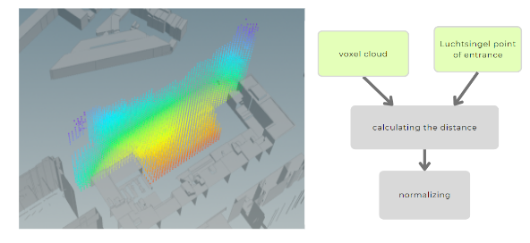

To calculate scores for each voxel grid, a total of six different analyses were conducted. Firstly, two types of sound analyses were conducted to evaluate the impact of noise on the voxels. Herefore, the sound of the clubs and the trains was calculated to evaluate this. Secondly, a sunlight analysis was run to ensure that all dwellings have the minimum of 2h of sunlight requirements.Thirdly, the closeness to ground analysis was implemented to ensure that some programs are located on the ground level, such as the care center or the assisted elderly. Lastly, the proximity to the desired entrance area at the Luchtsingel and the proximity to the road access were considered (especially for the parking placement). 

### Sound Analysis: Clubs 
To calculate the impact of the sound levels of the clubs at the Schieblock, namely Anabel and Perron, the clubs were considered as point sources. Then, the distance from each voxel to the sound source was calculated. 

### Sound Analysis: Train 
To calculate the impact of the sound from the adjacent train lines, a .tiff file was imported, namely the “Geluid in Nederland” file from Atlas Leefomgeving. Then, the highest values were grouped as the sound source of the rail tracks. Next, the distance from each voxel to the noise from the train was first calculated and then normalized. 

### Sunlight Analysis 
To calculate the sunlight hours, a sun path was imported from *sunearthtools.com* for the given site location. Next, the number of hits for each voxel, considering the surrounding buildings, was calculated. Then, the number of hits were assigned for each point and normalized.  

### Closeness to Ground Analysis
To ensure that elderly and other residents in need are closer to the ground, a “closeness to ground” analysis was implemented. For this, the height value for each voxel was calculated and then normalized. 

### Proximity to Entrance 
An entrance point to the Luchtsingel was defined as an entry point to the buildings. From this, the proximity to it was considered as a criteria. 

### Proximity to Road Access
To ensure that the car parking program is placed at the road, an criteria was added which defines the proximity to the road access. 

