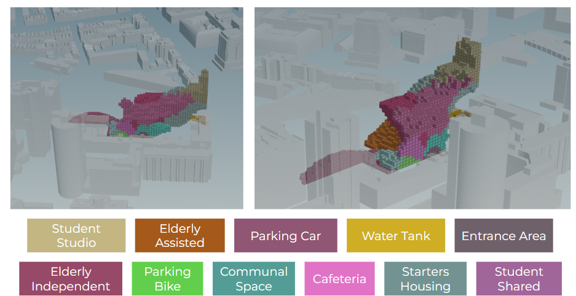
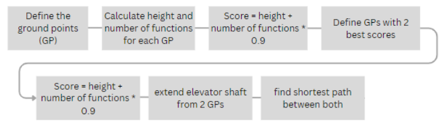
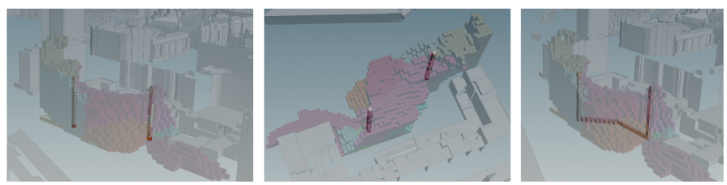
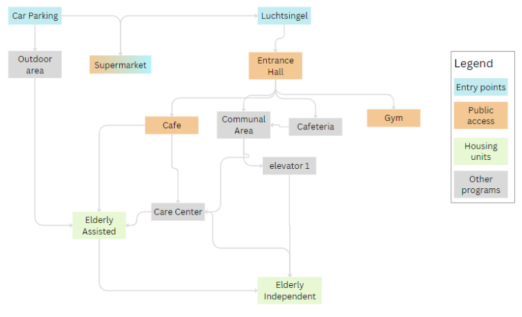
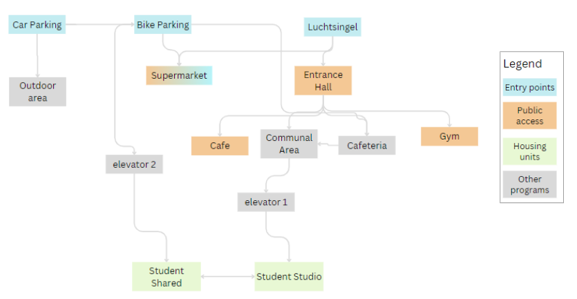
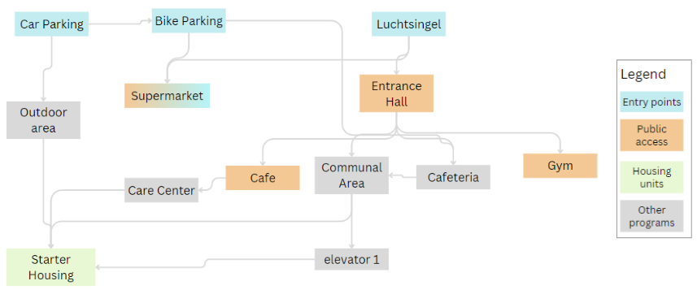

As discussed in the previous page, the final building shape was chosen based on the scenario F (see an image below). In the image you also see the programs color coordinated. 

After all the functions are placed in the building, the circulation of the residents in the building is looked into. For this, we have created two elevator shafts in the building. These elevator shafts are placed according to the best position. The best position is defined as the elevator reach a maximal height, whilst crossing as many functions as possible. 

### Elevator Shafts 

To define the optimal positions for the elevators all the ground points of the building are selected. For each ground point the vertical height and the number of functions above the ground point are calculated. Then, the different ground points are scored and the ground points with the best scores are chosen for the location of the elevators. Next, the elevator ground points are extended into the height. Lastly, the shortest path between the two is calculated to best represent the circulation between the two elevators in relation to the programs. 

Below is a depiction of the created workflow: 

The following elevator shaft placement and shortest path resulted from this: 

### Circulation in the building 

According to the elevator and program placement, the different user experiences and scenarios are visualized. Each type of resident moves differently throughout the building. 

Below is an flow diagram of how the elderly (independent and assisted) move through the building" 

Below is an flow diagram of how the students (starters and studios) move through the building" 

Below is an flow diagram of how the starters move through the building" 

 

