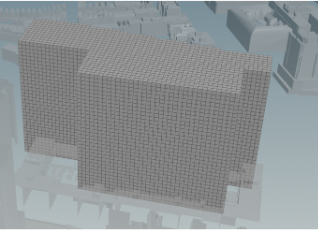
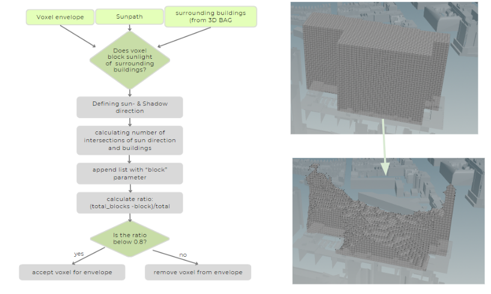
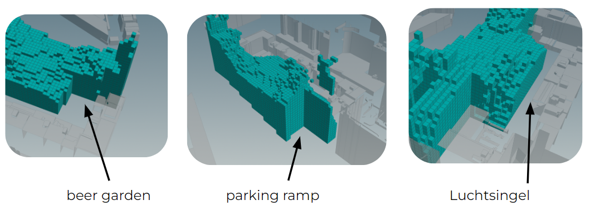

### Voxel Grid

Initially, the entire available plot was filled with a 3m * 3m * 3m voxel grid. Three meters was chosen as a suitable size, as this complies with any height requirements and is large enough to allow for enough space in hallways for movement.

### Shade Analysis

To reduce the amount of shade that AFFINITY casts on surrounding buildings, and analysis was run which removes voxels that case too much shadow on surrounding buildings. 

The shade analysis makes use of three different inputs: the voxel envelope, the sunpath, and the surrounding buildings from the 3D BAG website. The aim of this analysis is to check if each voxel blocks the sunlight from the surrounding area. For this the voxels are connected to the sunpath, which represents the sun hitting each voxel. Contrarily, the opposite direction represents the direction of the shade. Then, the number of shade direction intersection points is calculated. To calculate a ratio representative of the percentage of blocked surrounding buildings, the amount of blocks is subtracted from the total amount of sunblocks, and then divided by the total amount of blocks. If the ratio is below 0.8, the voxel is accepted for the envelope, if the ratio is above 0.8 the voxel is removed. See the below flow diagram for a simplified workflow and the visualization from Houdini of the resulting envelope.

### Part Removal 

To account for existing surrounding structures, the calculated shape after the sunlight analysis is adapted to remove the existing beer garden, the existing parking ramp, as well as the Luchtsingel. The Luchtsingel is a yellow path throughout Rotterdam which connects the main features of the city, and hence needs to be maintained in the construction of AFFINITY. Further, this provides a sense of familiarity and connection with the rest of the city. 

