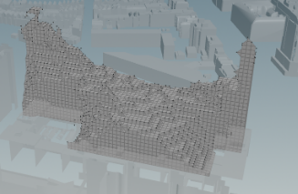

### Voxel Grid

Initially, the entire available plot was filled with a 3m * 3m * 3m voxel grid.3m was chosen as a suitable size, as this complies with any height requirements and is large enough to allow for enough space in hallways for movement.

### Shade Analysis

To reduce the amount of shade that AFFINITY casts on surrounding buildings, and analysis was run which removes voxels that case too much shadow on surrounding buildings. 

ADD DESCRIPTION OF HOW THIS WAS DONE 

### Part Removal 

To account for existing surrounding structures, the calculated shape after the sunlight analysis is adapted to remove the existing beer garden, the existing parking ramp, as well as the Luchtsingel. The Luchtsingel is a yellow path throughout Rotterdam which connects the main features of the city, and hence needs to be maintained in the construction of AFFINITY. Further, this provides a sense of familiarity and connection with the rest of the city. 

