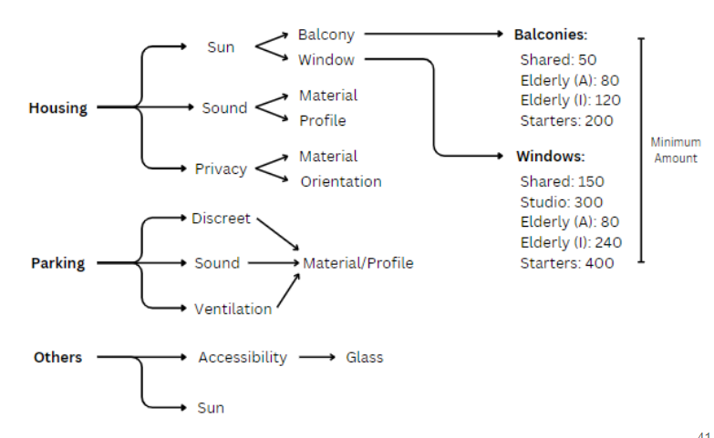

### Grouping of Facades
To place the facades, we have defined three groups of programs: housing, parking, and others. *Housing* concerns the elderly, student, and starter accommodations. *Parking* concerns the bike, as well as car parking. *Others* concerns all other functions. 

For the housing, the sun analysis  is considered as a factor whether to place a balcony or a window. If there is more sun, a balcony is placed, if less, a window. The balcony requirements for the shared students are a total of 50, for the assisted elderly 80, for the independent elderly 120, and for the starters 200 (see figure below). Hence, there are a total of 450 balconies. To ensure that the sound reaching the housing dwellings is minimized, the type of material and the profile is considered. To secure the privacy of the residents, the type of material and the orientation is taken into consideration. 

To warrant that the parking maintains a level of ventilation, sound absorption and remains discreet, the material and the profile are considered. 

For the other programs, glass material is considered to make the programs more accessible and visible for the residents and users of the programs. 

Please see the image below for a schematic overview of the facade definition:

### Types of Facades 

To assign the facade with different elements, three main classes are created: (1) walls, (2) balconies, and (3) roofs. To classify the walls, there are walls with windows, sound walls, glass walls, car park walls with holes for ventilation, and green walls. Depending on the type and purpose of a function, the walls are assigned accordingly. The balconies can either be located in a corner, on or in somethings, and are placed accordingly. The roofs are either classed as a green roof, or a floor, also depending on the height of the building. 

See the image below for the different types of facade classes. 

See the image below for the building shape with the defined facade types. 

