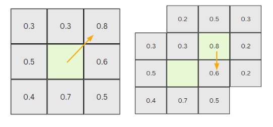
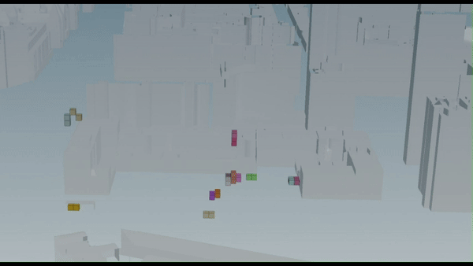

To reach the desired area for each program of our AFFINITY building, the growing function starts at each seed point (=voxel with optimal values for each function). The seed point is then recognized as the parent voxel. From this the neighboring voxels (children) are checked to see if they are empty or occupied. If they are empty, the values for each voxel, under consideration of the function's weights, are evaluated and the algorithm chooses the next best voxel. For example, if a program has the seed point with a value 0.9 (considering the program’s weights), and the next best surrounding voxel has a value of 0.8, this neighboring voxel will be chosen. The growing algorithm stops when the desired area is reached. 

For our AFFINITY building, the growing algorithm began with 16 seed points as we have 16 different programs. 
If you follow the link below, you can see a video of the growing algorithm that reaches our final desired design. 

