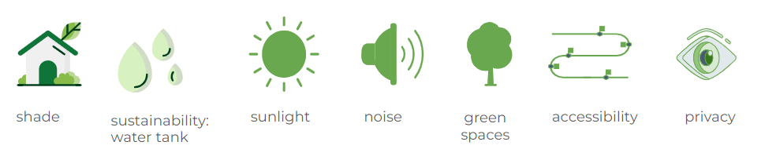
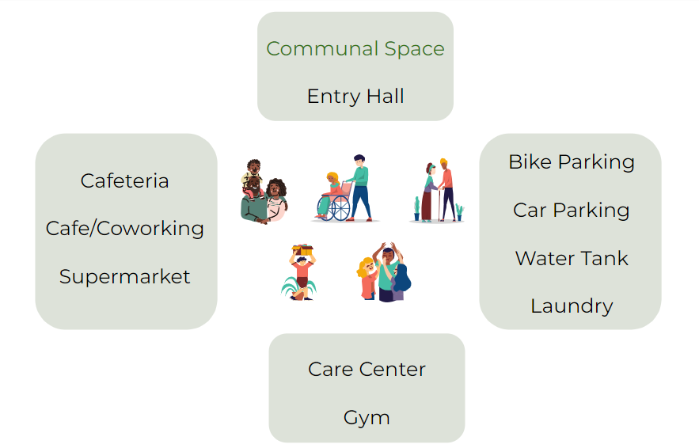

# Considerations 
To best integrate the residents and the many programs, AFFINITY takes seven considerations into account. Firstly, the amount of shade our building casts on its surroundings should be kept minimal. Second, the aspect of sustainability is considered by integrating a water tank in our building that not only serves the purpose of providing a buffer for extreme storms, but also enabling the reuse of rainwater within the building. Third, the amount of sunlight should be maximized in the housing units, and all housing functions should have a minimum of 2h of sunlight, as regulated by Dutch regulations. Fourth, noise levels of the surrounding, specifically the railway and clubs, are considered in placing the different functions. Fifth, an emphasis is laid on placing various greenspaces throughout the building, since increased urban green cover helps reduce urban heat and wind speeds (Leijnse, 2023). Sixth, our building is accessible for all, meaning that our hallways, elevators, and other tight spaces offer much more space than the minimum wheelchair width of 0.85m. Seventh and lastly, within the building the different resident types should have minimal exposure to each other to ensure privacy, as well as remaining a private building when viewed from the outside. 

# Programs 
Building on our seven considerations, a total of 16 programs were defined for AFFINITY. Five of these concern the housing, namely: the student studios, student shared apartments, starter units, elderly assisted, and elderly independent units. Beyond this, the communal space is considered the “heart” of the building where all residents can spend time together, in the form of communal activities. Three main dining options are offered within the building: the cafeteria (open for meals and intended for all residents to mingle), the cafe/coworking space (mainly intended for students and starters to work and grab a coffee), and the supermarket (open for the public and all residents). To ensure the health of all residents, the care center is offered as a healthcare facility specifically for the elderly and small children of starters. Further, the gym serves as a workout space for all and physiotherapy for the elderly. Beyond this, AFFINITY offers parking space for all using cars or bikes, and a laundry facility directed at students in need of this.

