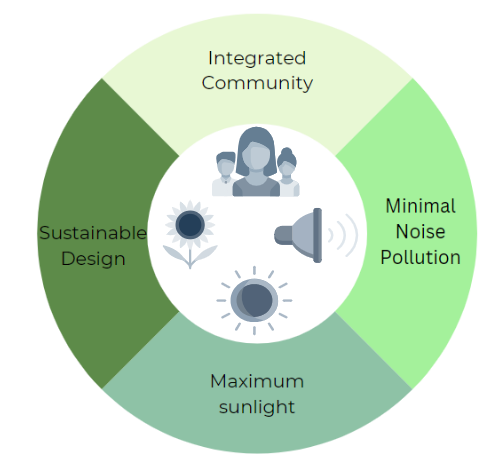
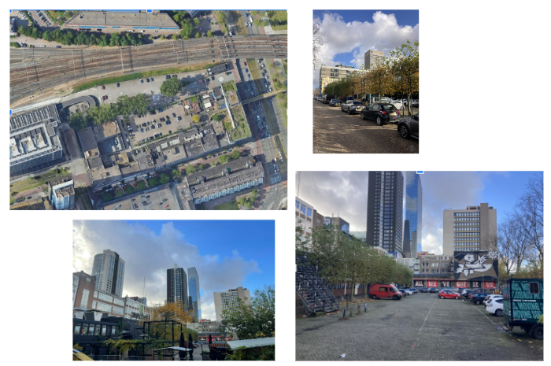

# Vision
To expand the current Schieblock in Rotterdam, we make use of procedural design to implement a new community-orientated sustainable building. Our proposed building, AFFINITY, will provide 400 homes for students, 200 homes for elderly, and 200 homes for starter families. Through publicly accessible facilities, like a gym, supermarket, or cafe, our building expands upon the idea of a community gathering point of the current Schieblock. 

To optimize the our project has three main goals: 

### 1. Integrating Community
Integrating the current community and future residents is at the heart of the AFFINITY building project. The idea of keeping the current establishments, such as the beer garden and music venues, yet enhancing the homely feeling of the neighborhood are keys of the project. 

### 2. Enhancing Sustainability 
As a part of our building a watertank is integrated, which is directed at sustainable rainwater harvest and combating strong flood events. Further, our choice in building materials is based on choosing those with a smallest environmental impact. 

### 3. Maximizing the Sunlight to all Functions 
To maximize the amount of sunlight that all residents are exposed to, it is vital to ensure that all housing units comply and exceed the minimal Dutch regulations of 2 hours of sunlight per day. 

### 4. Minimizing Noise Pollution  
To focus on tranquility and harmonious living, the noise pollution of surrounding buildings should be kept minimal for all residents.

# Site Location 
As a building site, the Schieblock in Rotterdam is chosen. Located in close proximity to Rotterdam Centraal train station, the site has a tight connection to the center of Rotterdam. Currently, the site contains a large area only occupied by car parking, which offers an optimal location to enhance community living and improve the feel of the area. Noticeably, the site contains many entertainment venues, such as clubs and a beergarden. The aim of our project is to integrate and build upon the existing venues. See an image below for reference of the site. 

 

