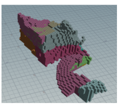

Throughout the shape and building definition, several different scenarios with different weights and combinations were investigated to find the best suitable building shape. A total of six scenarios were looked into. 

### Scenario A
In Scenario A, a combination of relatively high weights was generally chosen, especially in comparison to the final weights. Further, for most programs, the criteria “proximity to road access” and “proximity to entrance” was given a high weighting. 

### Scenario B 
Here, the criteria “closeness to the ground” was lowered, and the two criteria “proximity to entrance” and “proximity to road access” were also lowered. These three criteria were lowered to ensure that these criteria are not weighed unproportionately (especially in comparison to more important criteria, such as the sunlight analysis). The voxel size was also changed to 3m x 3m x 3m in this scenario, since previously we had set the voxel size to 2m x 2m x 2m. 

### Scenario C
In this scenario, the weights for all functions of the “proximity to entrance” criteria were changed in such a way that only the entrance hall desires to be close to this point. This change was made because otherwise too many functions were drawn to the Luchtsingel. 

### Scenario D
In this scenario, the sound criteria and analysis was still grouped into one analysis, which resulted in the functions being drawn to the outskirts of the plot. Followingly, the sound analysis weights were lowered.

### Scenario E 
At this point we noticed that the sound criteria should be split into two different sound sources: the train and the clubs to give a better representation of the sound sources. Another reason for this was that the different residents perceive the sound sources very differently. For example, the elderly would dislike sound from the clubs at night when they are trying to rest, however, sound from the trains is probably not as disturbing.

### Scenario F 
Scenario F represents the final chosen building shape for AFFINITY. The parameters that were altered here included the “closeness to the ground” criteria, since many functions were growing too high in scenario E. The blockiness of the functions was also changed, to make sure the functions grow more in one shape. All in all, this design presented itself as most favorable and was hence chosen. 

