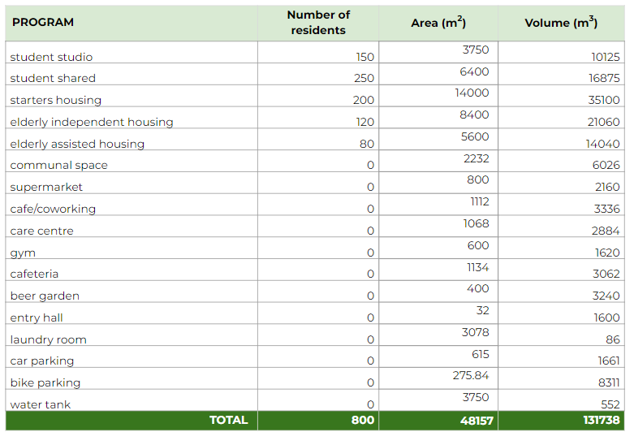
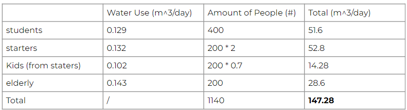

### Program Size  
The sizing of the programs for the building was calculated based on a set of requirements and the standard calculations for the public and communal spaces. 

The following requirements were given: 
- A minimum of 400 student units: which we divided into 250 shared student apartments, and 150 student studio 
- A minimum of 200 elderly units: which we divided into 120 independent and 80 assisted elderly units
- A minimum of 200 starter units 

From this, our conducted size calculations resulted in the following areas: 

### Watertank Calculation 
For each of the residents, an estimated water usage is calculated, see the table below. From the the daily and yearly water usage for the entire building is calculated. Hence, the average daily water usage per person per year in the building is estimated at 47.15m3. However, the size of the water tank is determined by the necessary size that it requires to serve as a rainwater buffer. 

During a storm with a 100-year recurrence interval, which takes 8 hours, 86.2mm of rainfall are expected (STOWA, 2019). With a total plot area at the Schieblock of 8000m2, 80% of the plot is expected to be paved. Hence, the water tank needs to be 551.68m3. 

*86.2mm * (8000m3 * 0.8) = 551.68m3*

