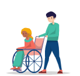
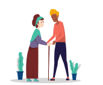
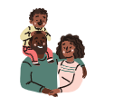
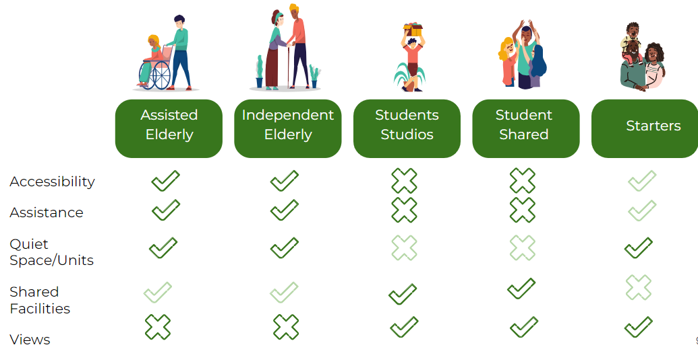

Our building accommodates five different types of residents: (1) assisted elderly, (2) independent elderly, (3) student studios, (4) student shared apartments, (5) starters. However, our buildings gives access to the public in a few selected programs, such as the supermarket, or gym. 

The following user perspectives are considered:

### Assisted elderly 
*"As someone living within the assisted units I will have private access to my accommodation via a separate entrance on the street level. I will have primary access to the Care Centre for my medical needs and the Cafeteria for eating. The communal space will also be highly accessible to me as my unit will most likely be on the ground or first floor. Everything I need is in close proximity and is lift accessible."*

### Independent elderly
*"As an independent elderly I will enter the building via the parking space after parking my car or bike, or via the entry hall. I will have my own kitchen and living space as well as an outdoor space, such as a terrace or balcony. The lifts should lead directly to my floor. I don’t need to live directly on the ground floor, however, not too high. I will also want distance to the Biergarten as I don’t want noise. I will have access to the Care Centre to easily seek help for any medical problems."*

### Student studio
*"When I arrive at the building I can park my bike in the private parking spaces. I then catch the elevator up to my floor (most likely upper). Using the corridor I go to my studio room. Inside I have my own kitchen and bathroom. I have easy access to the laundry and the gym. If I don’t feel like cooking for myself I will have access to the cafeteria within the building. I also have the opportunity to work here or at the cafe. I have access to a communal space and outdoor space if I want to spend time in the fresh air or with others."*

### Shared Student Apartments 
*"The way I enter the building and my unit is similar to the students living in studios. In my apartment I will have my own private room with a window and a shared kitchen, living space and possibly outdoor space. Likewise, if I don’t feel like cooking for myself I will have access to the cafeteria within the building. I also have the opportunity to work here or at the cafe. If I want to visit friends on other floors I can take the lift or walk in the semi outdoor hallways."*

### Starters
*"As a young couple living here we will access the building via the car and bike parking, where we will have our own parking spot. We will take the lift up and be living probably higher up. We will have two bedrooms in our unit, a kitchen, living space and outdoor space such as a terrace or balcony. We will be in close proximity to the Care Centre and the outdoor communal space to accommodate the needs of our child. We will also be close by to the gym and supermarket."*

### Summary of User Needs 
The needs of all residents is summarized in the following table. From the table it becomes clear that the elderly residents care a lot about the accessibility to the building, whereas the students care about the presence of shared facilities and potential views. 
In the following table a dark green check means the resident care a lot about this issue, a light green check they care a little, a dark green cross they do not care about this issue, and a light green check they don't care a lot. 

