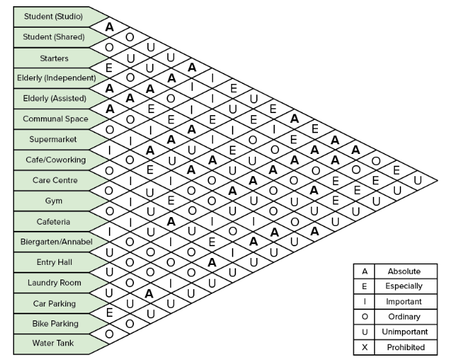
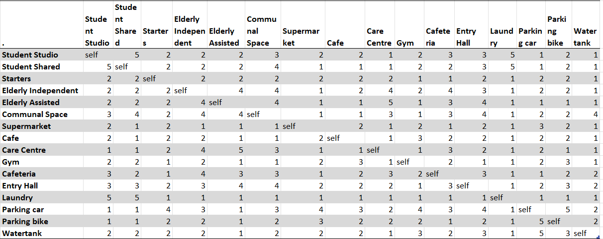

### REL-Chart 
To showcase the relationship between the different programs and resident dwellings, the following REL-chart was created. 

### Adjacency Matrix 
Further, we have defined that certain programs should be placed closer to each other than some functions. On a scale of 1 to 5, with 5 representing a strong connection between the two functions and 1 representing a low importance of connection. 

