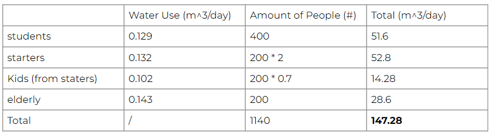

### Size Calculation of Water Tank 

For each of the residents, an estimated water usage is calculated, see the table below. From the the daily and yearly water usage for the entire building is calculated. Hence, the average daily water usage per person per year in the building is estimated at 47.15m3. However, the size of the water tank is determined by the necessary size that it requires to serve as a rainwater buffer. 

During a storm with a 100-year recurrence interval, which takes 8 hours, 86.2mm of rainfall are expected (STOWA, 2019). With a total plot area at the Schieblock of 8000m2, 80% of the plot is expected to be paved. Hence, the water tank needs to be 551.68m3. 

*86.2mm * (8000m3 * 0.8) = 551.68m3*

### Integration of Water Tank into building 

The water tank should not remain hidden in the building, but should serve as a recreational area with an intended teaching purpose. The water tank will be fully covered in green walls and roofs, enabling the growth of flowers on the top. Further, in front of the water tank an informational placard will be positioned to inform residents and the public what the water tank is used for. 

Here you can see a preview of the finished render of the water tank. For information about the positioning of the water tank continue reading this website. 

