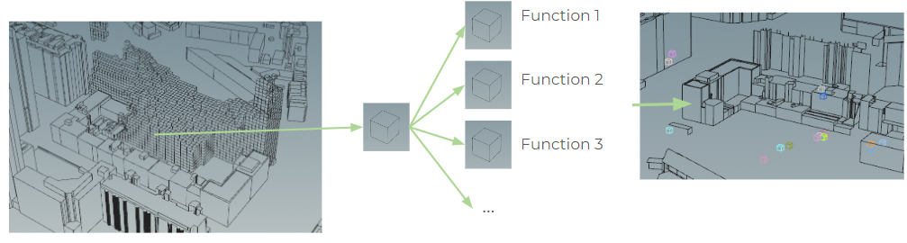
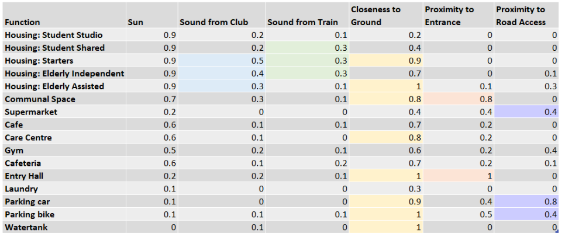

To evaluate the optimal voxel to place the seed point for each function growing, the scores for each voxel have previously been calculated (see “analyses” section), however, each function then assigns a weight to each analysis. For example, the starters value a high level of sunlight over closeness to the ground. After the scores are calculated, the weights are applied to each voxel. Taking the weights and scores of each voxel into consideration a seed point for each program is defined. In this context, a seed point refers to the optimal voxel for the program to start the growing algorithm. Below, a diagram depicts the process of calculating the position of the seed points for the different programs, and the location of the different seed points for our buildings. 

After various runs and scenarios analysis we came to the following set of weights that we applied to our growing algorithm. For the sun analysis, it was important to consider a high number of sun hours for all housing units, and the amount of received sunlight was of less importance for programs such as the supermarket or the gym. For the sound from clubs, the elderly assisted and independent, as well as the starters are concerned with having low sound levels. Further, the shared students, starters and elderly independent favor having less sound from the train tracks. Several programs require being close to the ground.The elderly assisted, the entry hall, bike parking and the water tank must be located on the ground level. Moreover, the the starters, communal space, care center, and car parking should also be located very close to, if not on the ground. Concerning the criteria “proximity to entrance”, the entry hall should be located directly at it, as well as the communal space should be located in proximity. The criteria “proximity to road access”, should be considered most by the car parking, since the cars require road access. The bike parking and supermarket should also be located close by, since these are intertwined programs. 

See the table below for an overview of the assigned weights.

